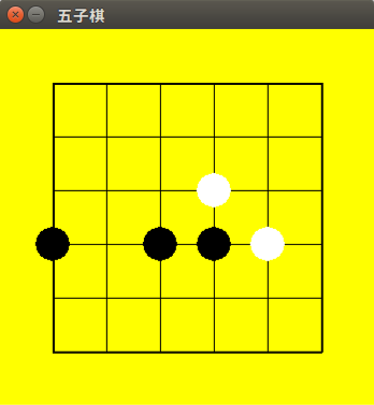

# Gobang-AlphaGo-zero
An implementation of AlphaGo Zero on Gobang 
## Project Analysis

- This is an implementation of the series of AlphaGo Zero papers on GoBang, relying on self-play to get intelligence.
- This implementation is a version of AlphaGo which stores data on the edge of MCTS, using neural network to policy decision.
- This project finished by personal computer, Ubuntu system, Python language, Tensorflow deep learning  framework, i7-4710HQ CPU, GTX 850M 4GB memory CPU, 12GB memory.
- Finally, I offered a model which can win definitely on 6X6 chessboard of four in a row as the first player.
- There is no more GPU resource for me to use, so I use a simple CNN referring  https://github.com/junxiaosong/AlphaZero_Gomoku instead of resnet mention in paper.
- When it comes to training model, I didn't find AlphaGo papers mention about how to use the self-play data(maybe I missed). First, I try the training method of the link above, storing the data of self-play in a deque, and the randomly sample the data in deque to adjust the parameters in neural network(which confused me is that, the method of the link adaptively change the learning rate according to KL divergence, according to the author, this method is mentioned in paper " Proximal Policy Optimization Algorithms ", after I read this paper, my understanding of this paper is quite different from the author of the link, and I didn't get good result when I apply this method to my project), so I just use Adam to update parameters.
- Another point that confused me is that, in a self-play game, if we consider the state of a chessboard as the MCTS tree's vertex, and the move as the edge from one vertex to another, in my implementation, I store the information needed by the formula in the edge, and the link above store the information in the vertex, I think that ignore the consistence of get to the same state through the different sequence of moves. In my perspective, I code the same way as AlphaGo paper. However, compare our two pure_mcts version's performance, my implementation needs more simulation-times to get appropriate intelligence as the link(something like block three in a row).
- Due to my poor understanding of Reinforcement-Learning, the choose of the hyper-parameters and the exploration-exploitation bandit, so it is hard for me to train a good model on 8X8 chessboard of five-in-a-row. Actually, in the training of 6X6 of four-in-a-row, I didn't come up with a good training method, the best model offered is running the whole night on my computer, and when I get up next morning, I found that the real_mcts player have a good performance against the pure_mcts version, so the model just finished.
- In the training process of model, the bigger of the chessboard, or the four-in-a-row becomes five-in-a-row, more difficult to train a good model, due to the large search space. As my pure_mcts, in 8X8 five-in-a-row, if I set simulation times 10000, which means do 10000 simulation before a move, I can say that achieve a high performance, but, when all status preserved, just change the size of chessboard to 15X15, it can be seen that there is nearly no intelligence.
- The project also offers a chessboard interface coded by pygame, and also offers a class for human-to-AI, AI-to-AI, and the visualization of self-play. 

  
- In a word, the implementation of pure_mcts, real_mcts, and the chessboard class is quite efficient and reasonably for me, and in the similar project have the value of reference. But in the training method of Reinforcement learing, due to the knowledge level, is not so reasonable, should be better.

## Future Work

- Just as the project analysis mentioned, the training process should be improved, that requires my deeper understanding of Reinforcement Learning and the training of neural network.
- This implementation didn't get the full use of a multithreading CPU, when it runs on my computer, when it runs the part of self-play, the usage of CPU is lower than 50%, if write code of multithreading can accelerate this part.
- If conditional permitting, I can use deeper CNN or resnet, and can try bigger chessboard.

## Environment

1. Install Python3 and IDE(Anaconda Spyder)
2. Install TensorFlow, both CPU or GPU version is okay.
3. Install pygame

## Instructions

1. If you want to play, run interface.py
2. If you want to train, run trainpipeline.py
